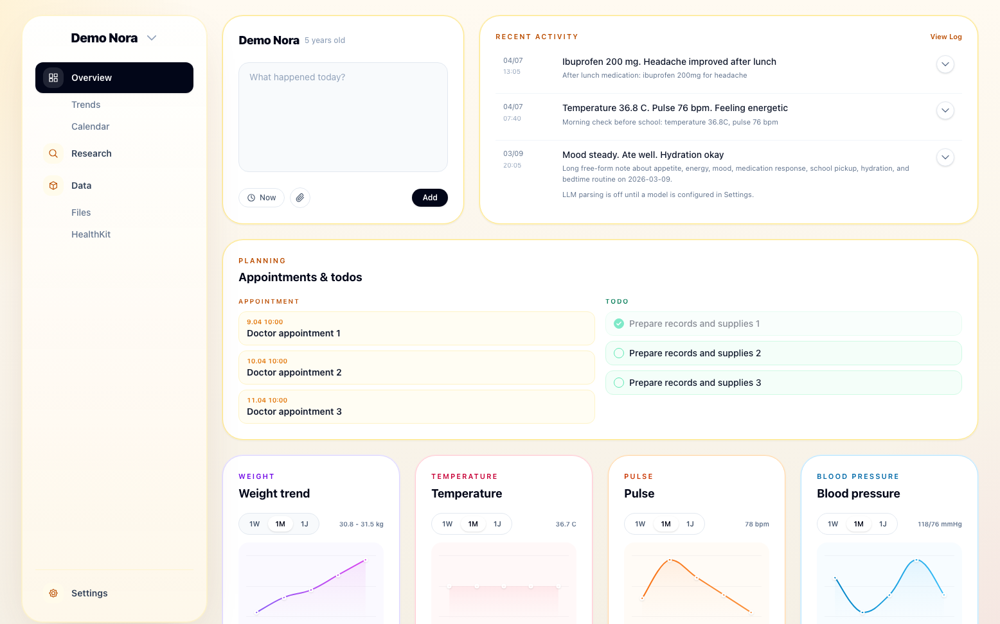

<p align="center">
  
</p>

<h1 align="center">UncleDoc</h1>

<p align="center">
  <strong>Your family's health record — self-hosted, LLM-powered, fully yours.</strong><br/>
  Enter notes, upload documents, track appointments and workouts.<br/>
  UncleDoc builds a living health record you can chat with via your own LLM.
</p>

<p align="center">
  
</p>

> UncleDoc is a self-hosted record-keeping tool, not a medical device. It does not provide medical advice, diagnosis, or treatment, and should support your documentation rather than replace professional care.
>
> All information processing that leads to suggestion is done by an LLM you provide (Bring your own LLM.).
>
> Also, this app is heavily vibe-coded and iteration speed is currently prioritized above all else, including security. Be careful to only run this locally / in your secured LAN.

## 1. Features

- Multi-person health records
- Fast timeline logging with file uploads
- Optional LLM parsing for notes, appointments, to-dos, and document content
- Baby mode for feeding, diapers, sleep, and growth
- HealthKit sync through the iOS app

**Key principe** is to enter data (e.g. a note, a uploaded PDF) that will then be parsed by your LLM to be condensed to key facts. The resulting health record (sum of all "facts") is what you can then chat with.

## 2. iOS App

UncleDoc also includes an iOS app so the same household health record feels at home on iPhone.
It can sync HealthKit data into UncleDoc, so measurements collected on your device can live alongside manual notes and uploaded documents.
The app stays intentionally thin, with the main product experience and your data remaining on your own UncleDoc server.

## 3. Prompts

UncleDoc keeps the active LLM system prompts in Markdown files under `prompts/`.

| Prompt | Used for | Loaded by |
| --- | --- | --- |
| [`prompts/parser.md`](prompts/parser.md) | System prompt for turning one note plus attachments into structured entry data | `EntryDataParser.system_prompt` |
| [`prompts/uncledoc.md`](prompts/uncledoc.md) | System prompt for summaries and chat against a person's health record | `LogSummaryGenerator.system_prompt` |

## 4. Installation

### Local dev

```bash
bin/dev
```

If you want demo content, run `bundle exec bin/rails db:prepare db:seed` first.

### Deploy

```bash
kamal setup
kamal deploy
```

## 5. Details

<details>
<summary>Stack</summary>

- Ruby `4.0.2`
- Rails `8.1`
- SQLite
- Hotwire (`turbo-rails`, `stimulus-rails`)
- Tailwind CSS
- Active Storage
- Solid Queue / Solid Cache / Solid Cable
- `ruby_llm`

</details>

<details>
<summary>Data model</summary>

UncleDoc keeps the core model intentionally small: people, accounts, timeline entries, app settings, and imported health data.

| Model | Purpose | Main fields |
| --- | --- | --- |
| `Person` | Household member being tracked | `name`, `birth_date`, `baby_mode`, `uuid` |
| `PersonState` | Mutable per-person runtime state | baby timer state |
| `User` | Login account linked 1:1 to a person | `email_address`, `password_digest`, `admin`, native app token |
| `Session` | Persistent web login session | `user_id`, `token`, request metadata |
| `Entry` | Main timeline item for manual logs and generated summaries | `input`, `occurred_at`, `facts`, `parseable_data`, `parse_status`, `source` |
| `UserPreference` | Saved display preferences | locale, date format |
| `AppSetting` | Saved global LLM configuration | provider, model, encrypted API key |
| `HealthkitRecord` / `HealthkitSync` | Raw imported iOS health data and sync state | source payloads, sync metadata |

Normal logging follows a simple three-layer flow:

| Layer | What it stores | Example |
| --- | --- | --- |
| Original input | The raw note or uploaded-document context | "Fever 38.2C after lunch" |
| Facts | Short human-readable takeaways | "Temperature 38.2 C" |
| `parseable_data` | Structured machine-readable items | `{ "type": "temperature", "value": 38.2, "unit": "C" }` |

</details>

<details>
<summary>Setup & demo data</summary>

For local development, start the app with:

```bash
bin/dev
```

`bin/dev` now starts:

- the Rails web app
- a Solid Queue worker via `bin/jobs`
- the Tailwind watcher

Development also uses the Rails default split SQLite setup:

- primary DB: `storage/development.sqlite3`
- queue DB: `storage/development_queue.sqlite3`
- cable DB: `storage/development_cable.sqlite3`
- cache DB: `storage/development_cache.sqlite3`

If you want seeded demo content first, run:

```bash
bundle exec bin/rails db:prepare db:seed
```

The seed data creates three demo profiles:

- `Demo Nora`
- `Demo Theo`
- `Demo Mila`

`Demo Nora` is the strongest walkthrough profile and includes the best overview/demo data.

Open it at:

```text
http://127.0.0.1:3000/Demo%20Nora/overview
```

This repo is also used in a LAN-only self-hosted setup:

- app directory: `/root/uncledoc`
- service: `uncledoc-dev.service`
- command: `bin/dev`
- environment: `development`
- bind: `0.0.0.0:3000`
- persistent DBs: `storage/development*.sqlite3`

Useful commands:

```bash
systemctl status uncledoc-dev.service
systemctl restart uncledoc-dev.service
systemctl stop uncledoc-dev.service
journalctl -u uncledoc-dev.service -f
```

</details>

<details>
<summary>User</summary>

UncleDoc now uses real account-based auth with a simple family-first model.

- Every `User` is linked to exactly one `Person`.
- Every route is protected by default.
- The first run screen is only shown on a truly empty system.
- A linked person can exist with login disabled until a password is set.

Admin users can:

- access Settings and the DB browser
- create, edit, and delete people/accounts
- set or reset passwords
- grant or revoke admin access
- configure global LLM settings

Non-admin users can:

- sign in
- view and use the main app
- access all family people/logs in the current v1 model
- not access admin/settings areas

The iOS app uses the normal web login for the Hotwire shell, then provisions a separate native app token for HealthKit sync requests.

</details>

<details>
<summary>LLM integration</summary>

LLM support is optional.

If configured, UncleDoc can:

- parse free-text notes into structured `parseable_data`
- generate summaries
- answer chat questions against a person's record
- store request/response metadata in `llm_logs`

Supported providers currently include `OpenAI`, `Fireworks`, `OpenRouter`, `Ollama`, `xAI`, `Mistral`, `Perplexity`, and `DeepSeek`.

The active prompts live in `prompts/`, and the global LLM provider/model/API key live in `AppSetting`.

</details>

<details>
<summary>HealthKit integration</summary>

The iOS app can sync HealthKit data into UncleDoc while keeping the main app experience in Rails.

| Layer | Purpose | Result in UncleDoc |
| --- | --- | --- |
| `HealthkitRecord` | Keep raw imported measurements | Preserves device-origin data |
| Sync / grouping | Organize records by person and import window | Makes updates repeatable |
| Generated summary `Entry` | Turn many readings into one usable timeline item | Daily or grouped health summary |

The native app signs into the normal web UI first, then uses a separate native app token for `/ios/healthkit/*` requests so background/device sync does not depend on browser cookies.

</details>

<details>
<summary>Project notes</summary>

- All user-facing UI text should go through Rails I18n.
- New UI text must include both English and German translations.
- Web UI changes should preserve Hotwire Native iOS behavior.
- Local app data in `storage/development.sqlite3` should be treated as valuable.

</details>

## Privacy

UncleDoc does not collect user data for its own service. The app is self-hosted, so your health data stays on infrastructure you control, and there is no central UncleDoc cloud.

If you enable AI features, you choose the LLM provider yourself. Any data sent to an LLM depends on the provider and configuration you decide to use.

## License

UncleDoc is released under the `O'Saasy` license. In practice, that means the code can be used, modified, and self-hosted, but not used to launch a competing hosted/SaaS version of UncleDoc itself. See [`LICENSE`](LICENSE).
