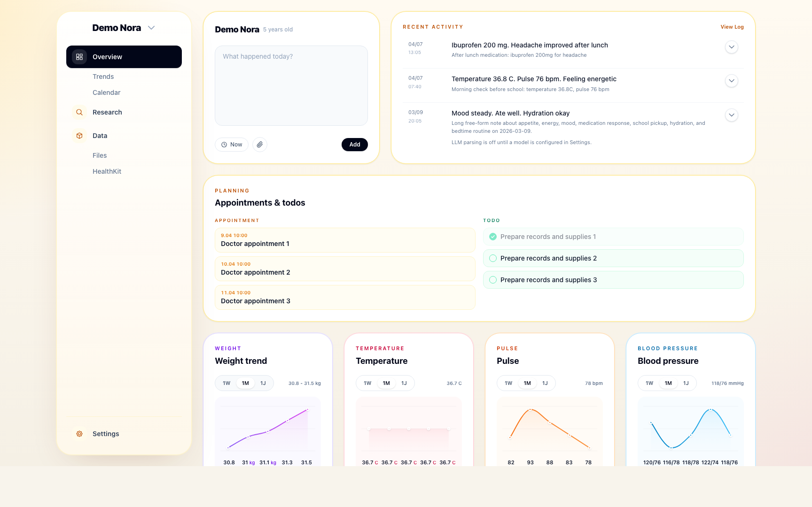

# UncleDoc

UncleDoc is a self-hosted family health manager built in Rails.

## 1. What It Does

UncleDoc helps a household keep health information in one place.

- Track multiple people in one household.
- Add timeline entries with free text, structured facts, timestamps, and optional file uploads.
- Browse a person-specific `Overview`, `Log`, `Trends`, `Calendar`, `Files`, `Baby`, and `HealthKit` area.
- Use a separate settings/admin area for users, preferences, raw DB browsing, LLM setup, prompt preview, and logs.
- Support both English and German via Rails I18n.

It can turn notes and uploaded documents into structured health records, and if an LLM is configured, that data can also power summaries and chat.



<details open>
<summary>Overview</summary>

- UncleDoc is designed for quick daily logging first, with structure added when useful.
- The overview page acts as the main dashboard for recent activity, planning, and trends.
- The admin/settings area keeps technical controls available without getting in the way of normal use.

</details>

<details>
<summary>Demo data</summary>

The seed data builds three demo profiles:

- `Demo Nora`
- `Demo Theo`
- `Demo Mila`

`Demo Nora` is the best overview/demo profile and includes curated recent activity, planning items, and chartable measurements.

After starting the app, open:

```text
http://127.0.0.1:3000/Demo%20Nora/overview
```

</details>

## 2. iOS App

<details open>
<summary>What is in the repo</summary>

UncleDoc also includes an iOS app that gives you a more native way to use the same household health record on iPhone. It can sync HealthKit data into UncleDoc, so measurements collected on the device can appear alongside manual notes and uploaded documents. The iOS app stays intentionally thin, with the main product experience still living in the Rails app.

</details>

## 3. Features

<details open>
<summary>Baby mode</summary>

UncleDoc includes a dedicated baby mode for households that want faster tracking during the newborn and infant phase. It adds baby-specific views and quick actions for feeding, diapers, sleep, and growth-related logging. That keeps the same health record structure, while making the everyday workflow much lighter for parents.

</details>

<details>
<summary>HealthKit integration</summary>

Rails exposes HealthKit endpoints under `/ios/healthkit/*`.

- `GET /ios/healthkit/people`
- `GET /ios/healthkit/status`
- `POST /ios/healthkit/sync`
- `DELETE|POST /ios/healthkit/reset`

Imported HealthKit data is stored separately from manual entries and can generate summary entries for a person.

</details>

## 4. Installation

<details open>
<summary>Requirements</summary>

- Ruby `4.0.2`
- Bundler
- SQLite3

</details>

<details open>
<summary>Local setup</summary>

```bash
bundle install
bin/rails db:prepare
bundle exec bin/rails db:seed
bin/dev
```

`db:seed` prepares the demo profiles, including `Demo Nora` for the overview demo.

</details>

<details>
<summary>Run tests</summary>

```bash
bin/rails test
```

</details>

<details>
<summary>What <code>bin/dev</code> starts</summary>

`Procfile.dev` runs:

- Rails on `0.0.0.0:3000`
- the Tailwind watcher

</details>

## 5. Details

<details open>
<summary>Stack</summary>

- Ruby `4.0.2`
- Rails `8.1`
- SQLite
- Hotwire (`turbo-rails`, `stimulus-rails`)
- Tailwind CSS
- Active Storage
- Solid Queue / Solid Cache / Solid Cable
- `ruby_llm`

</details>

<details>
<summary>Core data model</summary>

- `Person`: name, birth date, optional baby mode, stable UUID for iOS sync.
- `Entry`: original input, occurred time, parsed JSON data, generated facts, parse status, source, optional documents.
- `UserPreference`: locale, date format, LLM provider, model, encrypted API key.
- `HealthkitRecord` / `HealthkitSync`: raw HealthKit import state and records from the iOS app.

Normal logging starts with a person and an entry. An entry can stay as a plain note, or it can become a structured record after parsing or HealthKit import.

| Model | Purpose | Main fields |
| --- | --- | --- |
| `Person` | Household member being tracked | `name`, `birth_date`, `baby_mode`, `uuid` |
| `Entry` | Main timeline item for manual logs and generated summaries | `input`, `occurred_at`, `facts`, `parseable_data`, `parse_status`, `source` |
| `UserPreference` | Saved app and LLM preferences | locale, date format, provider, model |
| `HealthkitRecord` / `HealthkitSync` | Raw imported iOS health data and sync state | source payloads, sync metadata |

</details>

<details>
<summary>Normal data, parsing, and summaries</summary>

The normal flow is intentionally simple: write a note, attach a document if needed, and let UncleDoc keep it as-is or enrich it with structured data.

| Layer | What it stores | Example |
| --- | --- | --- |
| Original input | The raw note or uploaded-document context | "Fever 38.2C after lunch" |
| Facts | Short human-readable takeaways | "Temperature 38.2 C" |
| `parseable_data` | Structured machine-readable JSON items | `{ "type": "temperature", "value": 38.2, "unit": "C" }` |

This allows UncleDoc to stay useful even when parsing is unavailable, while still supporting trend widgets, follow-up planning, summaries, and chat when structured data exists.

</details>

<details>
<summary>LLM integration</summary>

If configured, UncleDoc can:

- parse free-text notes into structured `parseable_data`
- generate log summaries
- answer chat questions against a person's log
- store request/response metadata in `llm_logs`

LLM use is optional. The app still works without it.

Supported providers currently include:

- OpenAI
- Fireworks
- OpenRouter
- Ollama
- xAI
- Mistral
- Perplexity
- DeepSeek

Provider, model, and API key are managed from the settings UI.

</details>

<details>
<summary>Structured entry model</summary>

Structured entry items live in `parseable_data`, a JSON array of objects.

Common item types include:

- `temperature`
- `pulse`
- `blood_pressure`
- `weight`
- `height`
- `medication`
- `appointment`
- `todo`
- `breast_feeding`
- `bottle_feeding`
- `diaper`
- `sleep`

</details>

<details>
<summary>HealthKit data and compaction</summary>

HealthKit imports are stored separately first, then UncleDoc can compact that raw device data into timeline-friendly summaries for a person.

| Layer | Purpose | Result in UncleDoc |
| --- | --- | --- |
| `HealthkitRecord` | Keep raw imported measurements | Preserves device-origin data |
| Sync / grouping | Organize records by person and import window | Makes updates repeatable |
| Generated summary `Entry` | Turn many device readings into a readable timeline item | Daily or grouped health summary on the person's timeline |

This keeps the raw HealthKit history available while preventing the main log from becoming noisy with too many low-level measurements.

</details>

<details>
<summary>Local LAN service setup</summary>

This repo is also used in a LAN-only self-hosted setup:

- app directory: `/root/uncledoc`
- service: `uncledoc-dev.service`
- command: `bin/dev`
- environment: `development`
- bind: `0.0.0.0:3000`
- persistent DB: `storage/development.sqlite3`

Useful commands:

```bash
systemctl status uncledoc-dev.service
systemctl restart uncledoc-dev.service
systemctl stop uncledoc-dev.service
journalctl -u uncledoc-dev.service -f
```

</details>

<details>
<summary>Repo rules worth knowing</summary>

- All user-facing UI text should go through Rails I18n.
- New UI text must include both English and German translations.
- Web UI changes should preserve Hotwire Native iOS behavior.
- Local app data in `storage/development.sqlite3` should be treated as valuable.

</details>

## License

UncleDoc is released under the `O'Saasy` license. In practice, that means the code can be used, modified, and self-hosted, but not used to launch a competing hosted/SaaS version of UncleDoc itself. See `LICENSE`.
